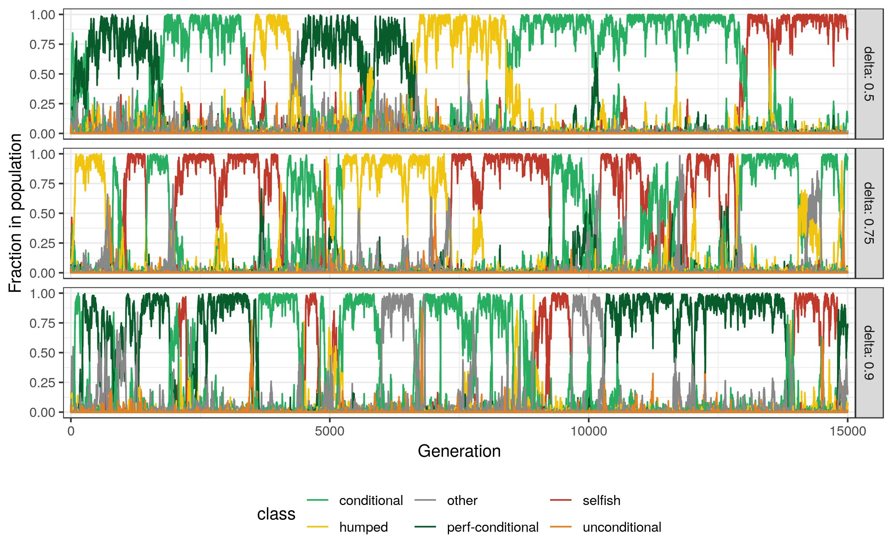

# Evolution of Conditional Cooperation in Prisoner's Dilemma - A.S.Saral

This is the repository for the simulations included in the study "The Evolution of Conditional Cooperation in Prisoner's Dilemma" which is a part of my PhD thesis atthe University of Trento. The preprint is available here: https://osf.io/wcpkz

The repository `R` files to generate the data, plots and the tables that are used in my preprint

There are two parts: 
* Simulation of the data
* Analysis of the data and producing graphs

Due to the heavy computational load of the first one, those two are separated. 

## Simulation
* `main_aggregated.R`: This file runs the whole simulation and it is the main file of the study (the one I used for the paper). The results for different simulations in each generation is averaged.
* `main.R`: This is an early version which saves the data for each Monte Carlo simulation in a different line. It is perfect for investigating individual cases but the output files are much bigger. 
### Files generated for the simulation (in the `./output` folder)
* `db_types_agg.csv`: The file keeps conditional agent types (0 to 81) and their average relative frequency for each generation 
* `db_actions_agg.csv`: The file keeps actions and their average relative frequencies for each generation. 
    
    Note: It takes so much time and processing power to run those simulations and it creates two big files (In order to replicate the current version of the paper, it needs around 3GB's of space). If you'd like to just to try the files, you can reduce the number of generations (`num_generations`) to a small number and check the output.
    
### Parameters
* `delta_range`: A vector of different `delta` values. Each `delta` stands for the probability of continuation in the next round.
* `num_agents` : Number of agents, ie. the size of the population
* `mistake_rate`: The probability of making a mistake. A mistake for an agent means that instead of playing the designated conditional response, it responds randomly from all possible actions (in my case and L,M,H). If it is equal to 0, every agent responds perfectly according to their type, if it is equal to 1, every agents plays randomly. 
* `mutation_rate`: The probability of random mutations. In other words the frequency of agents that will be replaced with a random type in each generation. The rest of the population will be probabilisticly generated according to the payoffs of the previous generation. If it is equal to 0, every agent type will be sampled according to the payoffs, if it is  equal to 1, in each generation, they will be regenerated randomly from a uniform distribution. See the function `generate_agents` in the file `functions.R` to see the underlying generation mechanism. 
* `num_generations`: Total number of generations. 
* `efficiency_rate`: Efficiency rate(b/c) of the social dilemma (Extended prisoners' dilemma game)

## Analysis 
`analysis.R`: It produces the tables and the images that are used in the paper. 

